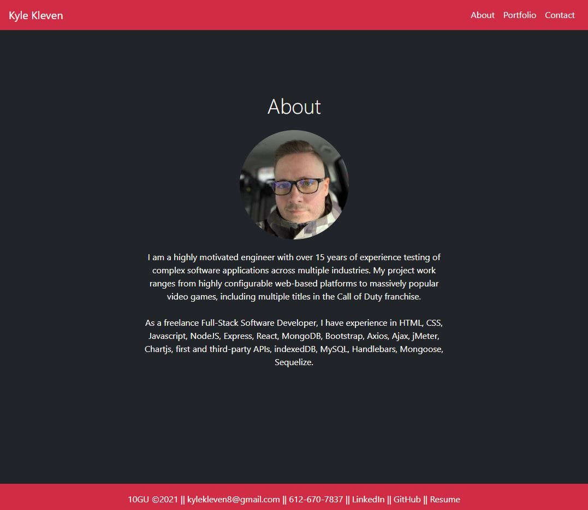

# Kyle Kleven: Portfolio

    

## Description

Welcome to my professional portfolio.
      
## Table of Contents
1. [Install Instructions](#install-instructions)
2. [Usage Instructions](#usage-instructions)
3. [License](#license)
4. [Contribution Guidelines](#contribution-guidelines)
5. [Test Instructions](#test-instructions)
6. [Questions](#questions)

## Install Instructions

Install dependencies
    
    npm install

Run the application

    npm start
  
## Usage Instructions

Navigate to https://kdkleven.github.io/me/

Use the header to navigate the site.

## Images

## License
  
This application is licensed under MIT License.
     

    

## Contribution Guidelines

Contributions are welcome!

## Test Instructions

There are currently no active tests.

## Questions

If you have any questions, contact the author:  

GitHub [@kdkleven](https://github.com/kdkleven)  
Email [kylekleven8@gmail.com](mailto:kylekleven8@gmail.com)
